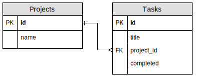

# SQL Intro

## Context and Landscape

### Why Databases

All applications will need to persist their data at some point. Remember how every time you restarted your TinyApp server, the data would reset to what was defined in the JavaScript? Well that's what we want to make sure **doesn't** happen

While we could just rely on some kind of file storage solution (i.e. a `.json` or `.csv` file stored somewhere), this has it's own share of problems:

- When do you write to the file?
- When do we re-read data from the file?
  - Only on app launch or whenever the file changes?
- How do we make sure that data stays consistent? (Remember the Music Library exercise from W1? What happens if the playlist references a track that doesn't exist?)

This is where a Relational Database Management System (RDBMS) like PostgreSQL comes into play.

### Why SQL (history, rationale, etc)

Structured Query Language (SQL) is used to issue commands to our RBDMS servers. It has two main advantages over other read/write APIs:

1. SQL has the ability to access many records with a single command
2. It also eliminates the need to state _how_ to reach a record.

SQL also has a basis in relational algebra and tuple referential calculus, in other words it's backed by some solid scientific theories.

By 1986, ANSI and ISO standard groups officially adopted the standard "Database Language SQL" language definition. New versions of the standard were published in 1989, 1992, 1996, 1999, 2003, 2006, 2008, 2011, and most recently, 2016.

> Read more here: https://en.wikipedia.org/wiki/SQL

## Writing SELECT statements against a two-table database

### Setup

In order to work with the examples in this doc, you'll first have to setup the database with our seeded data. This can be done by following these steps:

1. Open a terminal
2. Clone the project
3. Login to your SQL server
   ```
   $ psql
   ```
4. Create a database to load the seed into
   ```
   # CREATE DATABASE w5d1;
   ```
5. Exit `psql`
   ```
   # \q
   ```
6. Load the seed SQL into the database
   ```
   $ psql -d w5d1 < seed.sql
   ```

Here's a view of the DB Structure:



The first thing you'll notice is each table has an `id` column marked as a `PK`, this is our "Primary Key", in other words, a unique identifier which identifies each row. In this database, all of our `id` values are just sequencially incrementing integers (i.e. 1, 2, 3, 4, 5, 6, ...).

We also have a field marked as a "Foreign Key" in our `Tasks` table, this is a column which references the `id` column of the `Projects` table.

### Basic `SELECT`

The first thing we'll look at as far as SQL code goes, is the `SELECT` statement. This is your main tool in querying the data in the database.

> Don't forget to take a look at the PostgreSQL documentation on the `SELECT` statement: https://www.postgresql.org/docs/9.6/sql-select.html

```sql
SELECT * FROM projects;
```

This is the most basic select statement. What we're doing here is asking for all the columns (`*`) from the `projects` table.

With our seed data it returns this result:

```
 id |  name
----+---------
  1 | Lotide
  2 | TinyApp
  3 | Tweeter
  4 | Midterm
(4 rows)
```

We could also only get back certain columns by replacing the `*` with the specific columns we want to retrieve:

```sql
SELECT name from projects;
```

Results in the following:

```
  name
---------
 Lotide
 TinyApp
 Tweeter
 Midterm
(4 rows)
```

### `WHERE`

The `WHERE` clause allows us to filter results from what is returned:

```sql
SELECT * FROM projects WHERE id > 2;
```

```
 id |  name
----+---------
  3 | Tweeter
  4 | Midterm
(2 rows)
```

We can also combine the conditions with the logical operators `AND` and `OR`

```sql
SELECT * FROM projects WHERE id > 2 AND name LIKE 'T%';
```

```
 id |  name
----+---------
  3 | Tweeter
(1 row)
```

There are a few things happening here so let's break it down:

1. First pull out all columns from the projects table
2. Return only rows where the `id` is greater than 2 AND the name column starts with the letter `T`
   - Here `LIKE` is used to do string comparison and the `%` is used to denote a wildcard match.
     - Alternatively there is the `ILIKE` operator which is case-insensitive

## `JOIN`s

In our example, we have two tables which are related by a single foreign key. In order to use this relation we can use a `JOIN` to connect the two tables based on the foreign key value:

```sql
SELECT projects.name, tasks.id, tasks.title, tasks.completed
FROM projects
JOIN tasks ON projects.id = tasks.project_id;
```

```
  name   | id |                 title                 | completed
---------+----+---------------------------------------+-----------
 Lotide  |  1 | Implement countLetters                | t
 Lotide  |  2 | Implement findKeyByValue              | t
 Lotide  |  3 | Implement assertObjectsEqual          | t
 Lotide  |  4 | Implement takeUntil                   | t
 Lotide  |  5 | Implement findKey                     | t
 Lotide  |  6 | Submit Lotide                         | f
 TinyApp |  7 | TinyApp & Express setup               | t
 TinyApp |  8 | URL Shortening                        | f
 TinyApp |  9 | Cookies in Express                    | f
 TinyApp | 10 | Add User Specific Features            | f
 TinyApp | 11 | Add in method override [stretch]      | f
 TinyApp | 12 | Submit TinyApp                        | f
 Tweeter | 13 | Positioning the Nav                   | t
 Tweeter | 14 | Setup Main Container                  | t
 Tweeter | 15 | Implement the Character Counter       | t
 Tweeter | 16 | Creating Tweets                       | f
 Tweeter | 17 | Dynamic Tweets                        | f
 Tweeter | 18 | Form Submission using AJAX            | f
 Tweeter | 19 | Fetching Tweets using AJAX            | f
 Tweeter | 20 | Display validation errors with jQuery | f
 Tweeter | 21 | Submit Tweeter Project                | f
 Midterm | 22 | Plan midterm project                  | f
 Midterm | 23 | Decide on front-end framework         | f
(23 rows)
```

The important part here is to tell Postgres how to connect the two tables. This is done using the `ON projects.id = tasks.project_id` line.

We can also run the previous as an implicit join:

```sql
SELECT projects.name, tasks.id, tasks.title, tasks.completed
FROM projects, tasks
WHERE projects.id = tasks.project_id;
```


### Aggregation and `GROUP BY`

Let's say we wanted to count how many tasks there are in total (in all projects). We can do this by using the `count()` aggregate function:

```sql
SELECT count(*) FROM tasks;
```

```
 count
-------
    23
(1 row)
```

Used in this manner we can count up all the rows, we can also use a `WHERE` clause to count all the completed tasks:

```sql
SELECT count(*) FROM tasks WHERE tasks.completed;
```

```
count
-------
     9
(1 row)
```

Now let's say we wanted to count all of the tasks per project. We can combine a `JOIN` with a `count()` to achieve that:

```sql
SELECT projects.name, count(tasks.id)
FROM projects
JOIN tasks ON projects.id = tasks.project_id;
```

```
ERROR:  column "projects.name" must appear in the GROUP BY clause or be used in an aggregate function
LINE 1: SELECT projects.name, count(tasks.id)
               ^
```

Here we can see a common error which occurs when using aggregate functions. The error itself says we will need to put `projects.name` into a `GROUP BY` clause to tell SQL to base the counts around the project names. By adding the `GROUP BY` clause:

```sql
SELECT projects.name, count(tasks.id)
FROM projects
JOIN tasks ON projects.id = tasks.project_id
GROUP BY projects.name;
```

```
  name   | count
---------+-------
 Tweeter |     9
 TinyApp |     6
 Lotide  |     6
 Midterm |     2
(4 rows)
```

### Complex `JOIN`s


There are many different types of joins. Let's say for instance we want to get the count of all of the completed tasks for each project. You might start off with something like:

```sql
SELECT projects.name, count(tasks.id)
FROM projects
JOIN tasks ON projects.id = tasks.project_id
WHERE tasks.completed
GROUP BY projects.name;
```

```
  name   | count
---------+-------
 Lotide  |     5
 Tweeter |     3
 TinyApp |     1
(3 rows)
```

But wait! Where is the `Midterm` project? Since it has no completed tasks it has no rows, but we still want the result to include `Midterm | 0`. There are two things we'll need to do to fix this up

1. First we'll need to do a `LEFT JOIN` as we want _ALL_ the rows from the "left" table (a.k.a. the `projects` table)
2. We can't use a `WHERE` clause in this case since it will remove rows from the result, instead we move the condition to the join's `ON` condition.

Here's the fixed up SQL:

```sql
SELECT projects.name, count(tasks.id)
FROM projects
LEFT JOIN tasks ON projects.id = tasks.project_id
  AND tasks.completed
GROUP BY projects.name;
```

```
  name   | count
---------+-------
 Tweeter |     3
 TinyApp |     1
 Lotide  |     5
 Midterm |     0
(4 rows)
```

Now we get back all of the projects even if they don't have any completed tasks.

### Sub-selects

The last thing we touched on was sub-selects. These are nested queries inside of a larger query. Let's take a look at an example, let's say we want to get the percentage of how many tasks are completed per project:

```sql
SELECT name,
  count(tasks.id) as total,
  (SELECT count(*) FROM tasks WHERE tasks.project_id = projects.id AND tasks.completed) as completed,
  (SELECT count(*) FROM tasks WHERE tasks.project_id = projects.id AND tasks.completed)::float / count(tasks.id) * 100 as percent
FROM projects
JOIN tasks ON projects.id = tasks.project_id
GROUP BY projects.id
ORDER BY projects.id;
```

```
  name   | total | completed |     percent
---------+-------+-----------+------------------
 Lotide  |     6 |         5 | 83.3333333333333
 TinyApp |     6 |         1 | 16.6666666666667
 Tweeter |     9 |         3 | 33.3333333333333
 Midterm |     2 |         0 |                0
(4 rows)
```

We've got a few things happening here:

1. Our main Sub-select is this `(SELECT count(*) FROM tasks as t WHERE t.project_id = p.id AND t.completed)`
   - This sub-select uses the `projects.id` to count the number of completed tasks for that project.
2. We then re-use that sub-select along with the `count(tasks.id)` to calculate the percentage
   - Also note the use of `::float` after the sub-select, this is to make sure the values are interpreted as floats and not ints otherwise we'll get 0 as values since it will be doing integer division.
