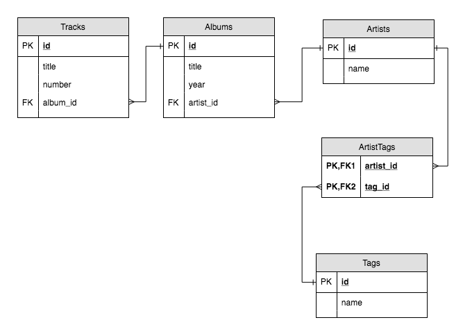

# W7D2 Lecture - ActiveRecord

Today we talked about `ActiveRecord` and it's use in the ruby ecosystem.

## `ActiveRecord`

ActiveRecord is an "Object Relational Mapper" (ORM). That means that it creates an equivalence between Ruby classes and SQL tables, and an equivalence between Ruby class instances and rows in a database table.

## Example Schema

In our example today we re-used the database we worked on in W4, here is the ERD for reference:

## Important Files

### [`setup.rb`](./setup.rb)

In the `setup.rb` file we load up all of our app dependencies (`pry`, `faker`, `active_record`) and setup the connection to the database. This file also sets up the schema used for our database using `ActiveRecord::Schema.define`.

### [`artist.rb`](./artist.rb), [`album.rb`](./album.rb), [`track.rb`](./track.rb), [`tag.rb`](./tag.rb)

These files contain the model definitions for our `ActiveRecord` models. Each of these classes inherit from the `ActiveRecord::Base` class which provides all of the ActiveRecord tools such as `Model.all`, `Model.find`, `Model.where` among many others that help us fetch data from the database.

These classes also define the relationships between each other. For example, in the `Artist` class, we can define that our artists have a many-to-one relationship by using the `has_many :albums` in the `Artist` class and `belongs_to :artist` in the `Album` class.

## How to run the example

1.  Clone the git repo.
2.  `cd` into the folder
3.  Run `bundle install` to fetch all the gems
4.  Make sure the database exists in postgres, if it doesn't you can create it in `psql` by using: `CREATE DATABASE w7d2_sept24_lecture;`
5.  Run `ruby setup.rb` to run the example.
